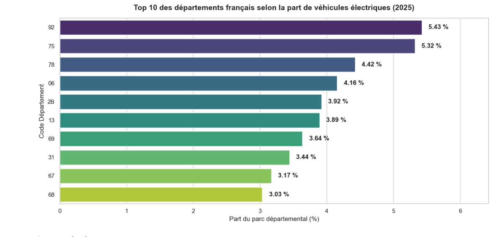
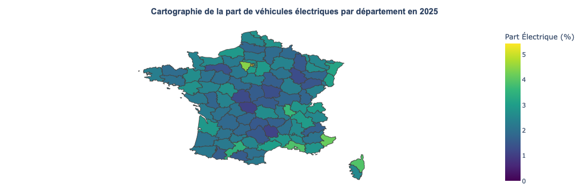

# Analyse territoriale de la transition du parc automobile français (2015–2025)

## Contexte

La transition énergétique transforme progressivement le parc automobile français. Les politiques publiques encouragent l'adoption de motorisations moins polluantes afin de réduire les émissions de gaz à effet de serre et d'améliorer la qualité de l'air.

Ce projet vise à analyser l'évolution du parc automobile français entre 2015 et 2025 et à mettre en évidence les disparités territoriales dans l'adoption des véhicules électriques.

---

## Problématique

**Comment le parc automobile français évolue-t-il vers des motorisations moins polluantes entre 2015 et 2025, et quelles disparités territoriales peut-on observer ?**

---

## Données utilisées

Source : Données ouvertes de Data.gouv.fr

Variables exploitées :

* Année
* Département
* Région
* Motorisation
* Classification Crit'Air

Les données brutes ne sont pas stockées dans ce dépôt en raison de leur taille importante.

---

## Méthodologie

1. Collecte et chargement des données publiques.
2. Audit qualité et compréhension du jeu de données.
3. Nettoyage et préparation des données.
4. Agrégation des indicateurs aux niveaux national, régional et départemental.
5. Analyse exploratoire et statistique.
6. Production de visualisations et cartographies.

---

## Résultats principaux

* Recul progressif de la part des véhicules diesel.
* Croissance soutenue des motorisations électriques et hybrides.
* Forte hétérogénéité entre territoires.
* Adoption plus rapide de l'électrique dans certains départements urbains et économiquement dynamiques.

---

## Technologies

* Python
* Pandas
* Matplotlib
* Jupyter Notebook
* Git / GitHub

---

## Structure du projet

```text
parc_auto_fr/
│
├── notebook/
│   └── parc_auto_fr.ipynb
│
├── figures/
│   ├── evolution_motorisation.png
│   ├── top10_departements.png
│   └── carte_electrique.png
│
├── data/
│   └── processed/
│
└── README.md
```

---

## Compétences mobilisées

* Data Cleaning
* Data Analysis
* Data Visualization
* Agrégation de données
* Analyse territoriale
* Git et reproductibilité


## Résultats

### Évolution des motorisations


### Top 10 des départements les plus électrifiés



### Cartographie de l'électrification



---

## Auteur

Almahaboub Fouad

Master Mathématiques, Modélisation et Apprentissage Statistique (MMAS)

Recherche d'une alternance en Data Science, Statistique et Intelligence Artificielle.
